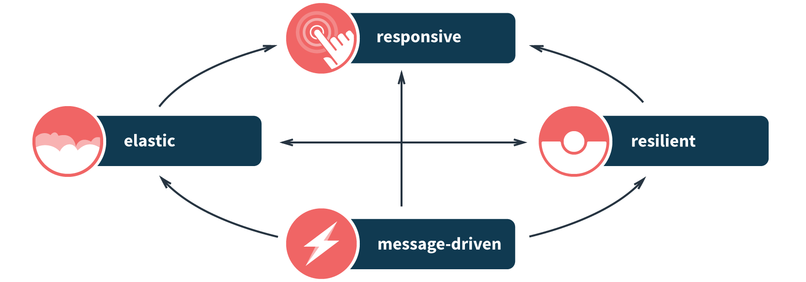
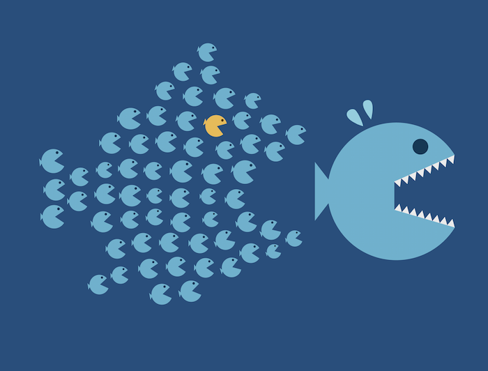
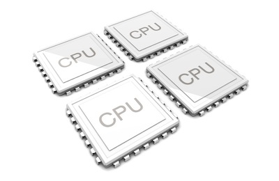
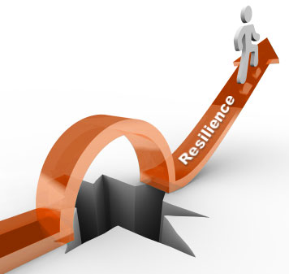
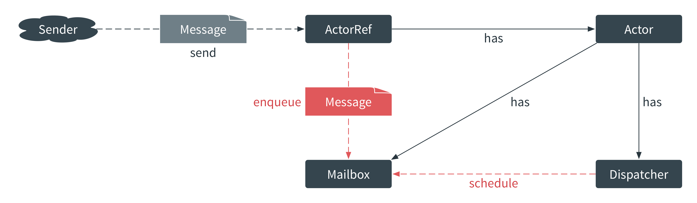
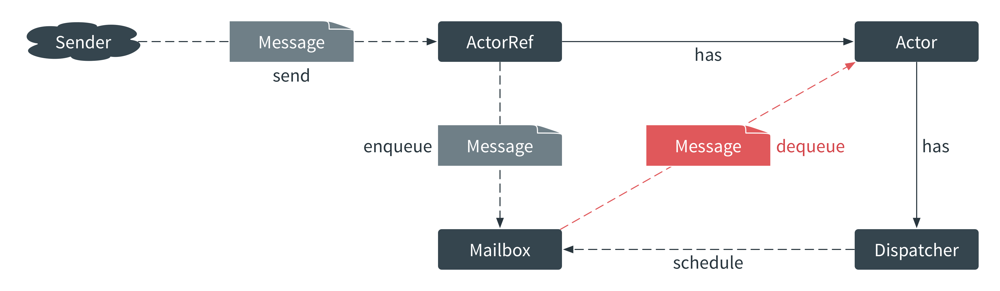
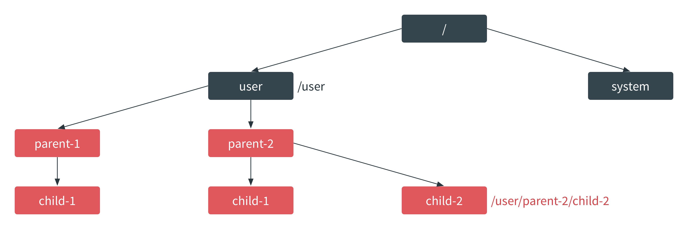

footer: 
autoscale: true
build-lists: true

# Reactive System Design

## Hands on with Akka and Java/Scala

***
## Introduction

- **Duncan K. DeVore**
- SWE @ Lightbend (Typesafe)
- Co-Author, Reactive Application Development, Manning

***

## Agenda

- **What is Reactive?**
- **Message Driven**
- **Resilience**
- **Elasticity**

***

# What is Reactive?

***

## Moth's and Programming

One of the fascinating things found in nature is the ability of a **species to adapt** to its changing environment. The canonical example of this is Britain’s **Peppered Moth**.

When newly industrialized Great Britain became polluted in the nineteenth century, slow-growing, light-colored lichens that covered trees died and resulted in a blackening of the trees bark.

The impact of this was quite **profound**!

***

## Moth's and Programming

- light-colored peppered moths, **camouflaged** and the **majority**
- found themselves the **obvious** target of many a hungry bird
- the rare, dark ones, now **blended** into the polluted ecosystem
- as the birds, **changed** from eating dark to light moths
- the dynamics of Britain’s moth population **changed**

***

## Moth's and Programming

### So what do moths have to do with programming?

***

## Moth's and Programming

The peppered moth was able to survive due to a mutation that allowed it to **react** to its changing environment. This ability to react _on-the-fly_ is what a **Reactive Application**. In reactive terms:

- React to load
- React to failure
- React to users

***

## Reactive Manifesto

- http://www.reactivemanifesto.org/
- Published on September 16 2014. (v2.0)
- Jonas Bonér, Dave Farley, Roland Kuhn, and Martin Thompson
- 11K + Signatures

***

## Reactive Principles



***

## Message Driven

**Reacting to messages**: Based on asynchronous communication where the design of sender and recipient are _not affected_ by the means of _message propagation_. As a result, you can design your system in isolation without worrying about how the transmission of messages occurs. Message-driven communication leads to a loosely coupled design that provides scalability, resilience and responsiveness.

***

## Elasticity

**Reacting to load**: The system stays responsive under varying workload. Reactive applications can actively scale up and down or scale in and out based upon usage or other metrics utilized by system designers, saving money on unused computing power but most importantly ensuring the servicing of growing or spiking user base.

***

## Resilience

**Reacting to failure**: The system stays responsive in the face of failure. Failure is expected and embraced and since many systems exist in isolation, a single point of failure remains just that. The system responds appropriately with strategies for restarting or re-provisioning, seamless to the overall systems.

***

## Responsiveness

**React to users**: The system responds promptly if at all possible. Responsiveness is the cornerstone of usability and utility, but more than that, responsiveness means that problems may be detected quickly and dealt with effectively.

***

# Why Reactive?

***

## A Little History

- One of the greatest impacts in the last 50 years has been The **internet**
- The US commissioned research to build a **robust**, **fault-tolerant** computer network
- Began with a series of memos by J.C.R. Licklider of MIT in August 1962
- Became known as the **Galactic Network** concept.
- He envisioned a **globally** interconnected network of computers

***

## A Little History Continued

- Allow users to access data and programs from **anywhere** in the world.
- J.C.R. Licklider - Director @ Information Processing Techniques Office
- (IPTO) was part of the Pentagon’s ARPA, the Advanced Research Projects Agency
- Today - DARPA, the Defense Advanced Research Projects Agency

***

## Distributed Computing

- A new computer model, **Distributed Systems** came into being
- It represented a shift in the computing paradigm.
- Before, the model was **large**, **expensive** mainframe systems
- Affectionately referred to as **Big Iron**.
- Mainframes used a **centralized** computing model
- Focusing on efficiency, local scalability, and reliability.

***

## Cloud Computing

- Distributed gave way to what we know as **Cloud Computing**
- A more powerful **less expensive** computing solution
- Cloud computing represents another **paradigm** shift
- Changing the way we reason about computer applications
- Distributed systems focus on the **technical** details
- Cloud computing focuses on the **economics** side of the equation

***

## Rethinking One's Value Proposition

As a result, many companies have begun to rethink their value proposition. Case and point:

- In January of 2008 Amazon announced that Amazon Web Services now **consume more bandwidth** than their entire global network of retail services, as shown in this figure from Amazon Blogs.[^1]

- What is Amazon? An **online bookstore** or **provider of Cloud Services?**


[^1]: image from Amazon Blogs - http://aws.amazon.com/blogs/aws/lots-of-bits/

***

## Storage, Network, CPU and Bandwidth

This new landscape of distributed cloud computing represents a **dramatic change** for the modern programmer, much like the Industrial Revolution of the nineteenth century did for the Peppered moth.

Recent hardware enhancement such as multi-core CPU’s and multi-socket servers provide computing capabilities that were non-existent as little as 8 years ago. The following shows the state of storage, CPU, and bandwidth compared to the number of network nodes. Notice the increase from the 70’s![^2]


[^2]: image from Oreilly Radar - http://radar.oreilly.com/2011/08/building-data-startups.html

***

## The Fast Fish


> "In the new world, it is not the big fish which eats the small fish, it’s the **fast fish** which eats the **slow fish**." --Klaus Schwab

***


***

## What is Akka?
<br>
> "Akka is a toolkit and runtime for building highly concurrent, distributed, and fault tolerant event-driven applications on the JVM." --Akka.io

***

## Akka is Reactive

- **Message Driven**: System foundation for elastic, resilient responsiveness
- **Elastic**: System stays responsive under varying workload
- **Resilient**: System stays responsive in the face of failure
- **Responsive**: System responds in a timely manner

***

## Akka's Value Proposition

- **Single Unified Programming Model**
- simpler concurrency
- simpler distribution
- simpler fault tolerance

***

# Simpler Concurrency



- **single-threaded** illusion
- No **locks** needed
- No **synchronized** methods
- No **primitives** needed

***

## Simpler Distribution


- **Distributed** by default
- Local to **Remote** by optimization
- Up **==** Out

***

## Simpler Fault-Tolerance



- Akka decouples communication from failure handling:
- Supervisors handle failure
- Callers need not care

***

# Message Driven

***

## The Actor Model

> "The actor is the fundamental unit of computation embodying processing, storage and communication." --Carl Hewitt

- Invented 1973 by Carl Hewitt
- Processing = behavior
- Storage = state

***

## Fundamental Concepts of the Actor Model

- Everything is an actor
- Each actor has an address

**Actors can**

- create new actors
- send messages to other actors
- change the behavior for handling the next message
- ...

***

## Anotomy of An Actor I


- Each actor is represented by an `ActorRef`
- You never get access to an `Actor` instance
- An actor reference lets you send messages to the actor

***

## Anatomy of an Actor II



- Each actor has a `mailbox` and a `dispatcher`
- The `dispatcher` enqueues and schedules message delivery

***

## Anatomy of an Actor III



- Only one message at a time is passed to the actor
- Delivery/processing - separate activities may be different threads

***

## Actors and Mutability
- Actors may have mutable state:
- Akka takes care of memory consistency
- Attention: **Don't** share mutable state!
- Actors exclusively communicate with message passing
- Attention: Messages **must be immutable!**

***

## Actor Systems I

> "One actor is no actor, they come in systems." --Carl Hewitt

- An actor system is a collaborating ensemble of actors
- Actors are arranged in a hierarchy:
- Actors can split up and delegate tasks to child actors
- Child actors are supervised and delegate their failure back to their parent

***

## Actor Systems II

- Actor Systems provide shared facilities:
- Factory for top-level actors: actorOf
- Dispatchers and thread pools: heavyweight
- Scheduling service: scheduler
- Access to configuration: settings.config

***

## Actor Systems III

- Publish-subscribe eventStream:
- Used internally for logging,
- Unhandled messages and dead letters, but open for user code
- There can be multiple actor systems per JVM or even per classloader, because Akka doesn't use any global state

***

## Anatomy of an Actor System



***

## Anatomy of an Actor System

- Within an actor system actors are arranged in a hierarchy
- Therefore each actor has a parent
- Top-level actors are children of the guardian
- Each actor can create child actors
- Each actor has a name which is unique amongst its siblings

***

## Implementing an Actor

``` java
public class CoffeeHouse extends AbstractLoggingActor{

    public CoffeeHouse() {
        log().debug("{} has opened!", "Coffee House")
        log().error(exception, "Bar closed!")

        // TODO Define behavior
    }
}
```

- To implement an actor extend with `AbstractActor` class
- To use Akka's logging facility extend with `AbstractLoggingActor` class

***

## Initial Behavior

``` java
public class CoffeeHouse extends AbstractLoggingActor{

  public CoffeeHouse() {

    receive(ReceiveBuilder.
             matchAny(o -> log().info("Coffee Brewing"))
             .build()
    );
  }
}
```

***

## Initial Behavior

- Behavior is simply a `PartialFunction<Object, BoxedUnit>`:
  - An actor can but need not handle any message
- `ReceiveBuilder` is used for building the partial function.
- The `receive` method takes in the actor's initial behavior:
  - The behavior can be changed at runtime (more to come later)

***

## Creating an Actor System

``` java
final ActorSystem system = ActorSystem.create("my-system");
...
system.terminate()
```

- To create an actor system call the `ActorSystem` factory method
- **Attention**: As an actor system is heavyweight, don't forget to *terminate* the actor system "at the end"!

***

## Creating an Actor

``` java
 system.actorOf(CoffeeHouse.props(), "coffee-house");
```

- To create an actor's you need `Props`:
  - `Props` configure an actor, most notably its class
  - To create `Props` use one of its factory methods
- To create an actor call the `actorOf` method of an `ActorRefFactory`:
  - This prevents you from accessing an actor directly
  - The optional name must not be empty or start with `'$'`

***

## Props Factories

``` java
public class CoffeeHouse extends AbstractLoggingActor{

  public static Props props(){
      return Props.create(CoffeeHouse.class, CoffeeHouse::new);
  }
...
```

- You could create `Props` in place when needed.
- For remoting `Props` need to be serializable.
- **Best practice**: Define *props* as a static factory method inside the corresponding actor.

***

## Creating a Top-Level Actor

``` java
ActorRef coffeeHouse = createCoffeeHouse();

protected ActorRef createCoffeeHouse(){
    return system.actorOf(CoffeeHouse.props(), "coffee-house");
}
```

***

## Creating a Top-Level Actor

- To create a top-level actor call `ActorSystem.actorOf`
- If you give a name, it has to be unique amongst its siblings
- If you create an anonymous actor, Akka synthesizes a name
- Creating an actor is an asynchronous operation
- **Best practice**: Use dedicated factory methods for creating top-level actors to facilitate testing

***

## Communication

``` java
ActorRef coffeeHouse = ...
...
this.coffeeHouse.tell("Nice Coffee!", self());
```

- To send a message to an actor, you need an actor reference
- Call its `tell` method with any message and actor reference of the sender
- Execution continues without waiting for a response in **fire-and-forget** manner

***

## Messages

``` java
public class Guest extends AbstractLoggingActor{
...
    public static final class CoffeeFinished{

        public static final CoffeeFinished Instance =
            new CoffeeFinished();

        private CoffeeFinished(){
        }
    }
...
}
```

***

## Messages

- **Attention**: Messages must be immutable!
- **Best practice**:
  - Use final static classes
  - You **must override** equals, hashCode and toString if your message takes parameters
  - Define the **message protocol** in the actor

***

## Including the Sender

``` java
final def tell(msg : scala.Any,
  sender : akka.actor.ActorRef) : scala.Unit = {
...
```

- You always have to send the ActorRef of the sender.
- If no sender is available use `Actor.noSender()`

***

## Using the Sender

``` java
public class Waiter extends AbstractLoggingActor{

    public Waiter(){

        receive(ReceiveBuilder.
                match(ServeCoffee.class, serveCoffee ->
                        sender().tell(new CoffeeServed(
                            serveCoffee.coffee), self())
                ).
                matchAny(this::unhandled).build()
        );
    }
...
````

***

## Using the Sender

- `sender` gives you access to the sender of the current message
- **Attention**: `sender` is a method, don't let it leak!

***

## Actor Context

``` scala
abstract class AbstractActor()
  extends scala.AnyRef
  with akka.actor.Actor {

  def getContext() : akka.actor.AbstractActorContext = {
  ...
}
```

***

## Actor Context

- Each actor has an *ActorContext*
- This provides contextual information and operations:
  - Access to *self* and the current *sender*
  - Access to  *parent* and *children*
  - Create child actors and *stop* actors
  - Death watch, change behavior, etc. (more to come later)

***

## Forwarding Messages

``` scala
abstract class ActorRef {
  def forward(message: Any)(implicit context: ActorContext) = ...
  ...
}
```

- *forward* sends a message passing along the sender from the actor context
- This way you can make an actor you are sending a message to respond to the actor you received the current message from

***

## Creating a Child Actor

``` java
public class CoffeeHouse extends AbstractLoggingActor{

  ActorRef guest = createGuest()

  protected ActorRef createGuest(Coffee favoriteCoffee,
    int caffeineLimit){

    return context().actorOf(
      Guest.props(waiter, favoriteCoffee,
        guestFinishCoffeeDuration, caffeineLimit));
  }
}
```

***

## Creating a Child Actor

- To create a child actor call *ActorContext.actorOf*
- Like for top-level actors you get back an *ActorRef*
- **Best practice**: Use dedicated factory methods for creating child actors to facilitate testing

***

## Exercise One

- Review the source code
- Add code @ // code to create guests should go here

***

# Resilience

***

## Actor Systems revisited


***

## Actor Systems revisited

- Within an actor system actors are arranged in a hierarchy
- Therefore each actor has a parent
- Each actor has a name which is unique amongst its siblings
- Therefore each actor can be identified by a unique sequence of names

***

## Actor Path

``` json
akka://my-system/user/ParentA/ChildA
akka.tcp://my-system@host.domain.com:5678/user/ParentA/ChildA

ActorPath path = coffeeHouse.path(); // akka://coffee-house-system/user/coffee-house

path.name() // coffee-house
```

***

## Actor Path

- An *ActorPath* encapsulates
  - the sequence of actor names together with
  - the transport protocol and
  - the address of the actor system
- To obtain an actor path call *path* on *ActorRef*
- To get an actor's name call *name* on *ActorPath*

***

## Embrace Failure

- Errors are a fact of life
- Don't worry, just [let it crash](http://letitcrash.com)
- Instead of trying to prevent failure simply handle it properly

***

## Failure in Akka

- Akka deals with failure at the level of individual actors
- An actor fails when it throws an exception (*NonFatal* throwable)
- Failure can occur
  - during message processing
  - during initialization
  - within a lifecycle hook, e.g. *preStart*
- How should such failure be handled?

***

## Fault Tolerance

``` java
@Override
public SupervisorStrategy supervisorStrategy() {
  return new OneForOneStrategy(false, DeciderBuilder.
    match(SomeException.class, e -> SupervisorStrategy.stop())
    ...
    .build())
}
```

***

## Fault Tolerance

- As you can see, a faulty actor doesn't bring down the whole system
- This fault tolerance is implemented through **parental supervision**:
  - If an actor fails, its message processing is suspended,
  - its children are suspended recursively – i.e. all descendants – and
  - its parent has to handle the failure
- Each actor has a supervisor strategy for handling failure of child actors
  - As you can see there is a default supervisor strategy in place

***

## Supervisor Strategies

- Akka ships with two highly configurable supervisor strategies:
  - *OneForOneStrategy*: Only the faulty child is affected when it fails
  - *AllForOneStrategy*: All children are affected when one child fails
- Both are configured with a *DeciderBuilder*:
  - Decider = PartialFunction<Throwable, Directive>
  - A decider maps specific failure to one of the possible directives
  - If not defined for some failure, the supervisor itself is considered faulty

***

## Supervisor Strategy Directives

- *Resume*: Simply resume message processing
- *Restart*:
  - Transparently replace affected actor(s) with new instance(s)
  - Then resume message processing
- *Stop*: Stop affected actor(s)
- *Escalate*: Delegate the decision to the supervisor's parent

***

## Restarting vs. Resuming

- Like stopping, restarting and resuming are recursive operations
- In both cases, no messages get lost, except for the "faulty" message, if any
- Resuming simply resumes message processing for the faulty actor and its descendants:
    - The actor state remains unchanged
    - Use *Resume* if the state is still considered valid

***

## Restarting vs. Resuming

- Restarting transparently replaces the affected actor(s) with new instance(s):
    - Actor state and behavior get reinitialized
    - Use *Restart* if the state is considered corrupted because of the failure
    - By default all children get stopped (see the *preRestart* lifecycle hook)
    - Any children that don't get stopped get restarted

***

## Fine-tuning Restarting

``` java
@Override
public SupervisorStrategy supervisorStrategy() {
  return new OneForOneStrategy(maxNrOfRetries, withinTimeRange,
    DeciderBuilder.
     match(SomeException.class, e -> SupervisorStrategy.stop())
    ...
    .build())
}
```

***

## Fine-tuning Restarting

- Restarting is tried up to *maxNrOfRetries* times within consecutive time windows defined by *withinTimeRange*
- If a window has passed without reaching the retry limit, retry counting begins again for the next window
- By default *withinTimeRange* is *Duration.Inf*, i.e. there is only one window

***

## Default Supervisor Strategy

- If you don't override *supervisorStrategy*, a *OneForOneStrategy* with the following decider is used by default:
  - *ActorInitializationException* -> Stop
  - *ActorKilledException* -> Stop
  - *DeathPactException*s -> Stop
  - Other *Exception*s -> Restart
  - Other *Throwable*s -> Escalates to it's parent
- Therefore, in many cases, your actor will be restarted by default

***

## Exercise Two

- Review the source code
- Add code @ // implement SupervisorStrategy here
- Add code @ // override SupervisorStrategy here

***

# Elasticity

